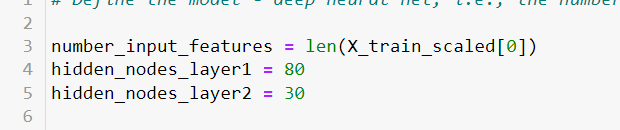
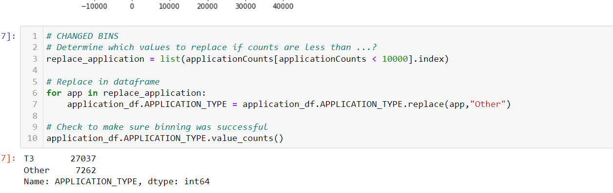
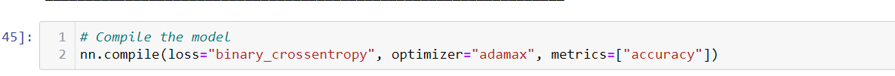

# Neural_Network_Charity_Analysis
## Overview
The purpose of this analysis was to read in data for a Alphabet Soup, and create a Machine Learning Neural Network Model, in order to accurately predict whether or not the our company should fund an organization. We used several inputs such as, Affiliation (business sector), and Ask Amount, in order to accurately predict if a company had successfully used the funded money for a successful campaign.

## Results 
### Data Preprocessing

* What variables are considered the target for your model?

For this model our target variable, or the variable that we are attempting to accurately predict was "IS_SUCCESSFUL". This means that we are trying to predict whether or not a company had successfully used our funding and the campaign was successful.

* What variables are considered the features? 

The features for this model were the variables that affected the target variable in this case it was APPLICATION_TYPE,AFFILIATION,CLASSIFICATION,USE_CASE,ORGANIZATION,STATUS,INCOME_AMT,SPECIAL_CONSIDERATIONS, and ASK_AMT.

*  What variables are neither and should be removed?

The variables that are not needed in this model were the identification variables of NAME and EIN.

### Compiling, Training, Evaluating the Model
*   How many neurons, layers, and activation functions did you select for your neural network model and why?
For this neural network the input features, hidden layer1 and hidden layer 2 can be seen in the screenshot below.

The reason for this selection is because the number of neurons in the input layer should always be very similar to the number of features in the data. In this scenario our number of input features was 43. I chose to have our first hidden layer cover a little under less than half of  the number of inputs.The reason for this is because we do not want to overfit or underfit our data. A second hidden layer helps improve accuracy for larger data sets so that is why that was chosen.

* Were you able to acheive target model performance? 

I was not able to acheive the performance. Our model accuracy was .7249

* What steps did you take to try and increase performance?

The first change that i attempted in my Neural Network was changing the bins for application counts, and for classification counts.

This resulted in a change in the number of features for our overall model. This resulted in an accuracy of .71

The second change that i attempted for my Neural Network was changing the optimizer from the adam method to the adamax optimizer method as seen in the screenshot below.

This method of optimization is an extension of the adam version that generalizes an approach to the infinite norm. It resulted in an accuracy of 0.7228.

The last change that i attempted for my Neural Network was changing the activation method for our layers from RELU to tanh to allow for a shape of (-1,1).

This resulted in an accuracy of 0.7248

## Summary

Overall the results of all of our neural network models resulted in an accuracy around .72 our best model being our first iteration of our neural network coming in with an accuracy of .7249. We attempted to improve performance by changing the bucket sizes for our categorical data, changing some of the data that is used for predictions but it resulted in a lower accuracy of .71. The best attempt was altering the method for our neural network layers from relu to tanh to allow for reshaping, which came in at .7249.

In some cases trying to use a neural network for predictions requires a lot of training and more frequently. Another model type that could be used for this particular scenario would be the decision tree model. The decision tree model will be able to provide some more insight into why a particular company had a successful campaign and why another did not. They also do not require as much training as a Nueral Network so less time will be needed from our standpoint.